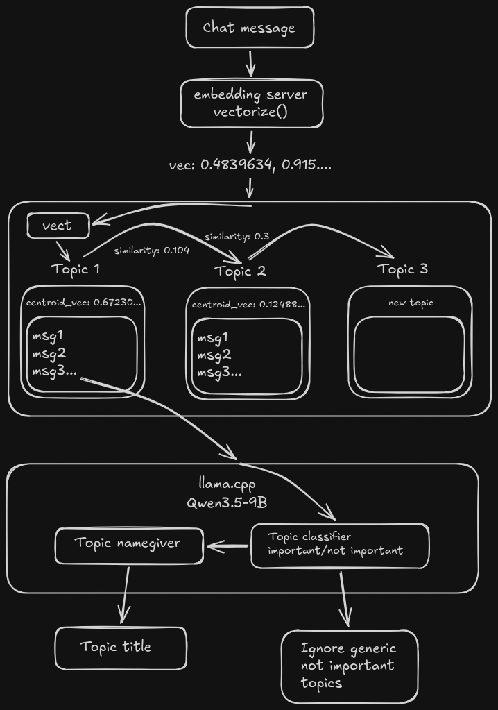

# Twitch Chat Topic Sorter

A Twitch bot that groups chat messages into topics using embedding similarity and an LLM-generated topic name.

The Twitch transport connects through EventSub, logs incoming messages. The topic-classification pipeline described below is not wired into the entrypoint yet.

## Project components

- **llama.cpp** LLM classifier, topic namegiver
- [reynkonig](https://github.com/reynkonig)'s [**embedding server**](embedding-server/README.md), pinned as a Git submodule from [the upstream repository](https://github.com/reynkonig/embedding-server)
- TODO: **webserver** to view resulted topics and control the bot

## Algorithm



## Prerequisites

- Node.js 26 and npm
- Python 3.13 and [uv](https://docs.astral.sh/uv/)
- A Twitch account with two-factor authentication enabled
- A registered [Twitch developer application](https://dev.twitch.tv/console/apps)
- The [Twitch CLI](https://dev.twitch.tv/docs/cli/) for the easiest local token setup

## Install

```sh
git submodule update --init --recursive
npm install
cp .env.example .env
```

If cloning a fresh checkout, `git clone --recurse-submodules ...` initializes the embedding server in the same step.

## Embedding server

The embedding service lives in `embedding-server/`. `vectorize(message)` from `src/embedding.ts` returns one normalized `number[]`. On its first call it reuses a healthy server on `127.0.0.1:8091`, or runs `uv run embedding-server --preload` in the submodule and waits for the model to become ready.

The default model is the pinned `sentence-transformers/all-MiniLM-L6-v2` revision with 384 dimensions. Override the matching `EMBEDDING_MODEL_ID`, `EMBEDDING_MODEL_REVISION`, and `EMBEDDING_DIMENSIONS` values together. `EMBEDDING_PORT`, `EMBEDDING_DEVICES`, `EMBEDDING_API_KEY`, and `EMBEDDING_INFERENCE_TIMEOUT_SECONDS` configure local startup and requests; see `.env.example` and the embedding server's [README](embedding-server/README.md). The topic pipeline does not call `vectorize` from the executable entrypoint yet.

## Twitch credentials

1. Register an application in the [Twitch Developer Console](https://dev.twitch.tv/console/apps). Use `http://localhost:3000` as an OAuth redirect URL and copy the application Client ID.
2. Generate a Client Secret for the Twitch CLI. The bot does not read this secret from `.env`.
3. Configure the CLI and request a user access token while logged into the account the bot should speak as:

```sh
twitch configure
twitch token --user-token --scopes "user:read:chat user:write:chat"
```

Copy the resulting User Access Token without an `oauth:` prefix. Tokens expire, so repeat this command when Twitch reports that the token is invalid.

Fill `.env`:


| Variable                | Value                                                                   |
| ----------------------- | ----------------------------------------------------------------------- |
| `TWITCH_CLIENT_ID`      | Client ID from the developer console                                    |
| `TWITCH_ACCESS_TOKEN`   | Raw user access token from`twitch token`                                |
| `TWITCH_CHANNEL`        | Login name of the channel to join; resolved to its ID at startup        |
| `TWITCH_BROADCASTER_ID` | Numeric user ID of the channel; required only when`TWITCH_CHANNEL` is unset |
| `TWITCH_BOT_USER_ID`    | Numeric user ID of the token owner; optional when it is the broadcaster |

To find the numeric ID associated with the token, load `.env` and validate it:

```sh
set -a
source .env
set +a

curl -s https://id.twitch.tv/oauth2/validate \
  -H "Authorization: OAuth $TWITCH_ACCESS_TOKEN"
```

Use the returned `user_id` as `TWITCH_BOT_USER_ID`. If the bot account owns the channel, use the same ID for `TWITCH_BROADCASTER_ID` and leave `TWITCH_BOT_USER_ID` blank.

For a different channel, the easiest option is to set `TWITCH_CHANNEL` to the channel's login name and leave `TWITCH_BROADCASTER_ID` blank — the bot performs this lookup itself at startup. To pin the numeric ID manually instead, look it up by login name:

```sh
curl -s "https://api.twitch.tv/helix/users?login=CHANNEL_LOGIN" \
  -H "Authorization: Bearer $TWITCH_ACCESS_TOKEN" \
  -H "Client-Id: $TWITCH_CLIENT_ID"
```

Use `data[0].id` as `TWITCH_BROADCASTER_ID`.

## Run

```sh
npm start
```

## Verify

```sh
npm test
npm run check

# Requires ./llama/llama_serve.sh to be running.
npm run test:llama
```

`npm test` uses deterministic mocks. `npm run test:llama` is slower and evaluates the configured model and prompts against live classification and description corpora. `BATCHSIZE` controls both llama.cpp server slots and live-evaluation concurrency and defaults to `4`.

## Topic sorting flow for each new message:

1. Generate normalized embedding V.
2. Compare V with every active topic centroid.
3. Select the topic with the highest cosine similarity.
4. If affinity >= threshold:
   add message to topic
   vector_sum += V
   centroid = normalize(vector_sum)
   message_count += 1
   Else:
   create a candidate topic centered on V
5. When candidate reaches 5 messages:
   generate a name from its sample messages
6. Delete candidate if it remains below 5 after 50 subsequent messages.
7. Retire confirmed topics after they have been inactive for a suitable window.
